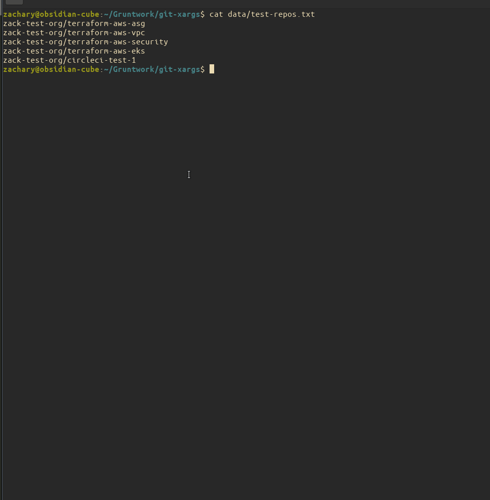

[](https://goreportcard.com/report/github.com/gruntwork-io/git-xargs)
[](https://circleci.com/gh/gruntwork-io/git-xargs)
[](https://formulae.brew.sh/formula/git-xargs)

# Table of contents

- [Introduction](#introduction)
- [Reference](#reference)
- [Contributing](#contributing)

# Introduction

## Overview


`git-xargs` is a command-line tool (CLI) for making updates across multiple Github repositories with a single command. You give `git-xargs`:

1. a script or a command to run
2. a list of repos

and `git-xargs` will:

1. clone each repo
1. run your specified script or command against it
1. commit any changes
1. open pull requests
1. provide a detailed report of everything that happened

Git-xargs leverages goroutines to perform the repo-updating work in parallel, so it is very fast.

For example, have you ever needed to add a particular file across many repos at once? Or to run a search and replace to change your company or product name across 150 repos with one command? What about upgrading Terraform modules to all use the latest syntax? How about adding a CI/CD configuration file, if it doesn't already exist, or modifying it in place if it does, but only on a subset of repositories you select?
You can handle these use cases and many more with a single `git-xargs` command.

## Example: writing a new file to every repo in your github organization

As an example, let's use `git-xargs` to create a new file in every repo:

```
git-xargs \
  --branch-name test-branch \
  --github-org <your-github-org> \
  --commit-message "Create hello-world.txt" \
  touch hello-world.txt
```

Here's what it looks like in action:



In this example, every repo in your org will have a new file named hello-world.txt written to it with the contents "Hello, World!". You'll then receive an easy-to-read printout of exactly what happened on `STDOUT`:

```
*****************************************************************
  GIT-XARGS RUN SUMMARY @ 2021-04-12 23:05:18.478435534 +0000 UTC
  Runtime in seconds: 4
*****************************************************************


COMMAND SUPPLIED

[touch hello-world.txt]

 REPOS SUPPLIED VIA --repos FILE FLAG
│────────────────────────│────────────────────────│
│ ORGANIZATION NAME (5)  │ URL                    │
│────────────────────────│────────────────────────│
│ zack-test-org          │ terraform-aws-asg      │
│ zack-test-org          │ terraform-aws-vpc      │
│ zack-test-org          │ terraform-aws-security │
│ zack-test-org          │ terraform-aws-eks      │
│ zack-test-org          │ circleci-test-1        │
│────────────────────────│────────────────────────│

 ALL REPOS THAT WERE TARGETED FOR PROCESSING AFTER FILTERING MISSING / MALFORMED REPOS
│───────────────────│────────────────────────────────────────────────────│
│ REPO NAME         │ REPO URL                                           │
│───────────────────│────────────────────────────────────────────────────│
│ terraform-aws-vpc │ https://github.com/zack-test-org/terraform-aws-vpc │
│ terraform-aws-eks │ https://github.com/zack-test-org/terraform-aws-eks │
│ circleci-test-1   │ https://github.com/zack-test-org/circleci-test-1   │
│───────────────────│────────────────────────────────────────────────────│


 REPOS THAT WERE SUCCESSFULLY CLONED TO THE LOCAL FILESYSTEM
│───────────────────│────────────────────────────────────────────────────│
│ REPO NAME         │ REPO URL                                           │
│───────────────────│────────────────────────────────────────────────────│
│ terraform-aws-eks │ https://github.com/zack-test-org/terraform-aws-eks │
│ circleci-test-1   │ https://github.com/zack-test-org/circleci-test-1   │
│ terraform-aws-vpc │ https://github.com/zack-test-org/terraform-aws-vpc │
│───────────────────│────────────────────────────────────────────────────│


 REPOS THAT SHOWED FILE CHANGES TO THEIR WORKING DIRECTORY FOLLOWING COMMAND EXECUTION
│───────────────────│────────────────────────────────────────────────────│
│ REPO NAME         │ REPO URL                                           │
│───────────────────│────────────────────────────────────────────────────│
│ terraform-aws-eks │ https://github.com/zack-test-org/terraform-aws-eks │
│ terraform-aws-vpc │ https://github.com/zack-test-org/terraform-aws-vpc │
│ circleci-test-1   │ https://github.com/zack-test-org/circleci-test-1   │
│───────────────────│────────────────────────────────────────────────────│


 REPOS THAT WERE SUPPLIED BY USER BUT DON'T EXIST (404'D) VIA GITHUB API
│────────────────────────│──────────│
│ REPO NAME              │ REPO URL │
│────────────────────────│──────────│
│ terraform-aws-asg      │          │
│ terraform-aws-security │          │
│────────────────────────│──────────│


 REPOS WHOSE SPECIFIED BRANCHES DID NOT EXIST ON THE REMOTE, AND SO WERE FIRST CREATED LOCALLY
│───────────────────│────────────────────────────────────────────────────│
│ REPO NAME         │ REPO URL                                           │
│───────────────────│────────────────────────────────────────────────────│
│ terraform-aws-eks │ https://github.com/zack-test-org/terraform-aws-eks │
│ terraform-aws-vpc │ https://github.com/zack-test-org/terraform-aws-vpc │
│ circleci-test-1   │ https://github.com/zack-test-org/circleci-test-1   │
│───────────────────│────────────────────────────────────────────────────│


*****************************************************
  PULL REQUESTS OPENED
*****************************************************
│───────────────────│────────────────────────────────────────────────────────────│
│ REPO NAME         │ PR URL                                                     │
│───────────────────│────────────────────────────────────────────────────────────│
│ circleci-test-1   │ https://github.com/zack-test-org/circleci-test-1/pull/82   │
│ terraform-aws-eks │ https://github.com/zack-test-org/terraform-aws-eks/pull/81 │
│ terraform-aws-vpc │ https://github.com/zack-test-org/terraform-aws-vpc/pull/77 │
│───────────────────│────────────────────────────────────────────────────────────│

```

## Getting started

### Installation option 1: Homebrew

If you are [Homebrew](https://brew.sh/) user, you can install by running

```bash
$ brew install git-xargs
```

### Installation option 2: Installing published binaries

1. **Download the correct binary for your platform**. Visit [the releases
   page](https://github.com/gruntwork-io/git-xargs/releases) and download the correct binary depending on your system.
   Save it to somewhere on your `PATH`, such as `/usr/local/bin/git-xargs`.

1. **Set execute permissions**. For example, on Linux or Mac, you'd run:

      ```bash
      chmod u+x /usr/local/bin/git-xargs
      ```

1. **Check it's working**. Run the version command to ensure everything is working properly:

      ```bash
      git-xargs --version
      ```

### Installation option 3: Run go get

1. Ensure you have Golang installed and working properly on your system. [Follow the official Golang install guide](https://golang.org/doc/install) to get started.

1. **Run go get to install the latest release of git-xargs**

`go get github.com/gruntwork-io/git-xargs`

1. **Alternatively, use go get to install a specific release of git-xargs**

`go get github.com/gruntwork-io/git-xargs@v0.0.5`

### Try it out!

1. **Export a valid Github token**. See the guide on [Github personal access
   tokens](https://docs.github.com/en/free-pro-team@latest/github/authenticating-to-github/creating-a-personal-access-token)
   for information on how to generate one. For example, on Linux or Mac, you'd run:

      ```bash
      export GITHUB_OAUTH_TOKEN=<your-secret-github-oauth-token>
      ```

1. **Provide a script or command and target some repos**. Here's a simple example of running the `touch` command in
   every repo in your Github organization. Follow the same pattern to start running your own scripts and commands
   against your own repos!

      ```bash
      git-xargs \
        --branch-name "test-branch" \
        --commit-message "Testing git-xargs" \
        --github-org <enter-your-github-org-name> \
        touch git-xargs-is-awesome.txt
      ```

# Reference

## How to supply commands or scripts to run

The API for `git-xargs` is:

```
git-xargs [-flags] <CMD>
```

Where `CMD` is either the full path to a (Bash, Python, Ruby) etc script on your local system or a binary. Note that, because the tool supports Bash scripts, Ruby scripts, Python scripts, etc, you must include the full filename for any given script, including its file extension.

In other words, all the following usages are valid:

```
git-xargs --repo --repo gruntwork-io/cloud-nuke \
   --repo gruntwork-io/terraform-aws-eks \
   --branch-name my-branch \
   /usr/local/bin/my-bash-script.sh
```

```
git-xargs --repos ./my-repos.txt \
  --branch-name my-other-branch \
  touch file1.txt file2.txt
```

```
git-xargs --github-org my-github-org \
  --branch-name my-new-branch \
  "$(pwd)/scripts/my-ruby-script.rb"
```

## Branch behavior

Passing the `--branch-name` (-b) flag is required when running `git-xargs`. If you specify the name of a branch that exists on your remote, its latest changes will be pulled locally prior to your command or script being run. If you specify the name of a new branch that does not yet exist on your remote, it will be created locally and pushed once your changes are committed.

## Default repository branch

Any pull requests opened will be opened against the repository's default branch (whether that's `main`, or `master` or something else).

## Git file staging behavior

Currently, `git-xargs` will find and add any and all new files, as well as any existing files that were modified, within your repo and stage them prior to committing. If your script or command creates a new file, it will be committed. If your script or command edits an existing file, that change will also be committed.

## Paths and script locations

Scripts may be placed anywhere on your system, but you are responsible for providing absolute paths to your scripts when invoking `git-xargs`:

```
git-xargs \
  --branch-name upgrade-tf-14 \
  --commit-message "Update modules to Terraform 0.14" \
  --repos data/batch3.txt \
  $(pwd)/scripts/my-ruby-script.rb
```

or

```
git-xargs \
  --branch-name upgrade-tf-14 \
  --commit-message "Update modules to Terraform 0.14" \
  --repos data/batch3.txt \
  /usr/local/bin/my-ruby-script.rb
```

If you need to compose more complex behavior into a single pull request, write a wrapper script that executes all your commands, or place all your logic into one script.

## How to target repos to run your scripts against

`git-xargs` supports **four** methods of targeting repos to run your selected scripts against. They are processed in
the order listed below, with whichever option is found first being used, and all others after it being ignored.

### Option #1: Github organization lookup

If you want the tool to find and select every repo in your Github organization, you can pass the name of your organization via the `--github-org` flag:

```
git-xargs \
  --commit-message "Update copyright year" \
  --github-org <your-github-org> \
  "$(pwd)/scripts/update-copyright-year.sh"
```

This will signal the tool to look up, and page through, every repository in your Github organization and execute the scripts you passed via the `--scripts` flag.

### Option #2: Flat file of repository names

Oftentimes, you want finer-grained control over the exact repos you are going to run your script against. In this case, you can use the `--repos` flag and supply the path to a file defining the exact repos you want the tool to run your selected scripts against, like so:

```
git-xargs \
  --commit-mesage "Update copyright year" \
  --repos data/batch2.txt \
  "$(pwd)/scripts/update-copyright-year.sh"
```

In this example, batch2.txt looks like this:

```
gruntwork-io/infrastructure-as-code-training
gruntwork-io/infrastructure-live-acme
gruntwork-io/infrastructure-live-multi-account-acme
gruntwork-io/infrastructure-modules-acme
gruntwork-io/infrastructure-modules-multi-account-acme
```

Flat files contain one repo per line, each repository in the format of `<github-organization>/<repo-name>`. Commas, trailing or preceding spaces, and quotes are all filtered out at runtime. This is done in case you end up copying your repo list from a JSON list or CSV file.

### Option #3: Pass in repos via command line args

Another way to get fine-grained control is to pass in the individual repos you want to use via one or more `--repo`
arguments:

```
git-xargs \
  --commit-mesage "Update copyright year" \
  --repo gruntwork-io/terragrunt \
  --repo gruntwork-io/terratest \
  --repo gruntwork-io/cloud-nuke \
  "$(pwd)/scripts/update-copyright-year.sh"
```

### Option #4: Pass in repos via stdin

And one more (Unix-philosophy friendly) way to get fine-grained control is to pass in the individual repos you want to
use by piping them in via `stdin`, separating repo names with whitespace or newlines:

```
echo "gruntwork-io/terragrunt gruntwork-io/terratest" | git-xargs \
  --commit-mesage "Update copyright year" \
  "$(pwd)/scripts/update-copyright-year.sh"
```

## Notable flags

`git-xargs` exposes several flags that allow you to customize its behavior to better suit your needs. For the latest info on flags, you should run `git-xargs --help`. However, a couple of the flags are worth explaining more in depth here:

| Flag                     | Description                                                                                                                                                                                                                                                                                                                                                                                                                     | Type    | Required |
| ------------------------ | ------------------------------------------------------------------------------------------------------------------------------------------------------------------------------------------------------------------------------------------------------------------------------------------------------------------------------------------------------------------------------------------------------------------------------- | ------- | -------- |
| `--branch-name`          | You must specify the name of the branch to make your local and remote changes on. You can further control branching behavior via `--skip-pull-requests` as explained below                                                                                                                                                                                                                                                      | String  | Yes      |
| `--repos`                | If you want to specify many repos and manage them in files (which makes batching and testing easier) then use this flag to pass the filepath to a repos file. See [the repos file format](#option-2-flat-file-of-repository-names) for more information                                                                                                                                                                         | String  | No       |
| `--repo`                 | Use this flag to specify a single repo, e.g., `--repo gruntwork-io/cloud-nuke`. Can be passed multiple times to target several repos                                                                                                                                                                                                                                                                                            | String  | No       |
| `--github-org`           | If you want to target every repo in a Github org that your GITHUB_OAUTH_TOKEN has access to, pass the name of the Organization with this flag, to page through every repo via the Github API and target it                                                                                                                                                                                                                      | String  | No       |
| `--commit-message`       | The commit message to use when creating commits. If you supply this flag, but neither the optional `--pull-request-title` or `--pull-request-description` flags, then the commit message value will be used for all three.                                                                                                                                                                                                      | String  | No       |
| `--skip-pull-requests`   | If you don't want any pull requests opened, but would rather have your changes committed directly to your specified branch, pass this flag. Note that it won't work if your Github repo is configured with branch protections on the branch you're trying to commit directly to!                                                                                                                                                | Boolean | No       |
| `--skip-archived-repos`  | If you want to exclude archived (read-only) repositories from the list of targeted repos, pass this flag.                                                                                                                                                                                                                                                                                                                       | Boolean | No       |
| `--dry-run`              | If you are in the process of testing out `git-xargs` or your initial set of targeted repos, but you don't want to make any changes via the Github API (pushing your local changes or opening pull requests) you can pass the dry-run branch. This is useful because the output report will still tell you which repos would have been affected, without actually making changes via the Github API to your remote repositories. | Boolean | No       |
| `--max-concurrent-repos` | Limits the number of concurrent processed repositories. This is only useful if you encounter issues and need throttling when running on a very large number of repos. Default is `0` (Unlimited)                                                                                                                                                                                                                                | Integer | No       |

## Best practices, tips and tricks

### Write your script to run against a single repo

Write your script as if it's operating on a single repo, then target many repos with `git-xargs`. Remember that at runtime, each of the scripts you select will be run, in the order you specify, once per repo that you've targeted.

### Handling prerequisites and third party binaries

It is currently assumed that bash script authors will be responsible for checking for prequisites within their own scripts. If you are adding a new bash script to accomplish some new task across repos, consider using the [Gruntwork bash-commons assert_is_installed pattern](https://github.com/gruntwork-io/bash-commons/blob/3cb3c7160fb72b7411af184300bf077caede37e4/modules/bash-commons/src/assert.sh#L15) to ensure the operator has any required binaries installed.

### Grouping your repos into separate batches

This is a pattern that ended up working out well for us as we wrote and executed more and more ambitious scripts across our many repos as a team:
By breaking your target repos into separate batches, (batch1.txt, batch2.txt, batch3.txt) and starting with a few repos (or even one repo!) in the initial batches, and then gradually expanding the batches in size, you can easily test your new scripts against a few repos and double check the generated pull requests for any issues prior to widening your target batches.

## How git-xargs works

This section provides a more in-depth look at how the `git-xargs` tool works under the hood.

1. git-xargs will clone each of your selected repos to your machine to the `/tmp/` directory of your local machine. The name of each repo, plus a random number each run, are concatenated together to form the local clone name to make the local repo easier to find in case you need to debug your script locally, e.g., `terraform-aws-module-security3978298`.
1. it will checkout a local branch (whose name you can optionally specify with the `--branch-name` flag)
1. it will run all your selected scripts against your selected repos
1. it will commit any changes in each of the repos (with a commit message you can optionally specify via the `--commit-message` flag)
1. it will push your local branch with your new commits to your repo's remote
1. it will call the Github API to open a pull request with a title and description that you can optionally specify via the `--pull-request-title` and `--pull-request-description` flags, respectively, unless you pass the `--skip-pull-requests` flag
1. it will print out a detailed run summary to STDOUT that explains exactly what happened with each repo and provide links to successfully opened pull requests that you can quickly follow from your terminal. If any repos encountered errors at runtime (whether they weren't able to be cloned, or script errors were encountered during processing, etc) all of this will be spelled out in detail in the final report so you know exactly what succeeded and what went wrong.

## Tasks this tool is well-suited for

The following is a non-exhaustive list of potential use cases for `git-xargs`:

- Add a LICENSE file to all of your GitHub repos, interpolating the correct year and company name into the file
- For every existing LICENSE file across all your repos, update their copyright date to the current year
- Update the CI build configuration in all of your repos by modifying the `.circleci/config.yml` file in each repo using a tool such as `yq`
- Run `sed` commands to update or replace information across README files
- Add new files to repos
- Delete specific files, when present, from repos
- Modify `package.json` files in-place across repos to bump a node.js dependency using `jq` https://stedolan.github.io/jq/
- Update your Terraform module library from Terraform 0.13 to 0.14.
- Remove stray files of any kind, when found, across repos using `find` and its `exec` option
- Add baseline tests to repos that are missing them by copying over a common local folder where they are defined
- Refactor multiple Golang tools to use new libraries by executing `go get` to install and uninstall packages, and modify the source code files' import references

_If you can instrument the logic in a script, you can use `git-xargs` to run it across your repos!_

# Contributing

## Contributing scripts to this project

We hope that this tool will help save you some time as you apply it to your own automations and maintenance tasks. We also welcome the community to contribute back scripts that everyone can use and benefit from.

Initially, we'll add these scripts to the `./scripts` directory in this repository and will eventually organize them into sub-folders depending on their purposes / use cases. If you would like to have your script considered for inclusion in this repo, please first ensure that it is:

- **High quality**: meaning free of typos, any obvious bugs or security issues
- **Generic**: meaning that it is likely to be of general use to many different people and organizations, and free of any proprietary tooling or secrets

Once you've done this, please feel free to open a pull request adding your script to the `./scripts` directory for consideration.

Thanks for contributing back! Our hope is that eventually this repo will contain many useful generic scripts for common maintenance and upgrading tasks that everyone can leverage to save time.

## Building the binary from source

Clone this repository and then run the following command from the root of the repository:

```
go build
```

The `git-xargs` binary will be present in the repository root.

## Running the tool without building the binary

Alternatively, you can run the tool directly without building the binary, like so:

```
./go run main.go \
  --branch-name test-branch \
  --commit-message "Add MIT License" \
  --repos data/test-repos.txt \
  $(pwd)/scripts/add-license.sh
```

This is especially helpful if you are developing against the tool and want to quickly verify your changes.

## Running tests

Tests are included within their respective packages.

```
go test -v ./...
```

## License

This code is released under the Apache 2.0 License. See [LICENSE.txt](/LICENSE.txt)
